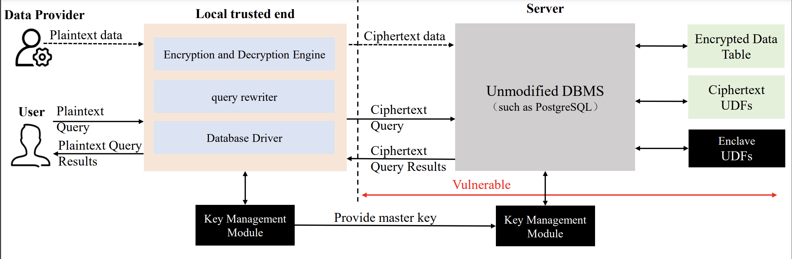

# $ Enc^2db $

-----

-----

## 1. Introduction

$Enc^2DB$ is a novel secure database system, following a hybrid strategy on PostgreSQL and openGauss. 

Within the system we present a micro-benchmarking test and self-adaptive mode switch strategy that can dynamically choose the best execution path, either cryptography or TEE, to answer a given query. Besides, we also design and implement a ciphertext index that is compatible with native cost model and query optimizers to accelerate query processing. Empirical study over TPC-C test justifies that $Enc^2DB$ outperforms either pure TEE or cryptography solutions. Besides, our ciphertext index implementation also outperforms the state-of-the-art cryptographic-based system.

## 2. System Architecture 

-----



**EDL Definition of UDFs:**

```C
public void ecall_sahe_add(cipher_t* expected,
													 [user_check] void* opl, [user_check] void* opr,
													 [user_check] void* ret, size_t outlen);
public void ecall_smhe_mul(cipher_t* expected,
													 [user_check] void* opl, [user_check] void* opr,
													 [user_check] void* ret, size_t outlen);
public void ecall_ore_compare([user_check] void* opl, [user_check] void* opr,
															[user_check] int* ret);
```


## 3. Installation

-------

### 3.1 Dependency

```shell
yum -y install make automake libtool cmake
yum -y install gmp-devel openssl-devel log4cpp-devel boost-devel
# install the protobuf
git clone https://github.com/protocolbuffers/protobuf.git
cd protobuf
git submodule update --init --recursive
./autogen.sh
./configure
 make
 make check
 sudo make install
 sudo ldconfig # refresh shared library cache.
```

### 3.2 Install the PostgreSQL

#### 3.2.1 Local Part

Currently only PostgreSQL 9.2.4 is supported

+ Download the source code of this project to `postgresql-9.2.4/src/interfaces/libpq/`

  ```shell
  git clone https://gitee.com/lihuixidian/enc-db.git postgresql-9.2.4/src/interfaces/libpq/encryptsql
  ```

+ Run the installation script

  ```shell
  cd postgresql-9.2.4/src/interfaces/libpq/encryptsql && sh setup.sh
  ```

+ Switch to the ```postgresql``` home directory and execute the compile command

  ```shell
  ./configure && make -j && sudo make install
  ```

#### 3.2.2 Server Part

Copy `libudf.so` in the directory `postgresql/src/interfaces/libpq/encryptsql/build/lib` to the server `pg_config --pkglibdir`, which is the lib folder of psql, and execute `createudf.sql` to create a UDF function on the server.

### 3.3 Install the OpenGauss

#### 3.3.1 Local Part

+ Download the source code of this project to `postgresql-9.2.4/src/interfaces/libpq/`

  ```shell
  git clone https://gitee.com/lihuixidian/enc-db.git postgresql-9.2.4/src/interfaces/libpq/encryptsql
  ```

+ Run the installation script

  ```shell
  cd postgresql-9.2.4/src/interfaces/libpq/encryptsql && sh setup_gs.sh
  ```

+ Swicth to the `opengauss ` home directory and executive the compile command

  ```shell
  sh build.sh
  ```

  For the specific compilation of opengauss, please refer to: <https://gitee.com/opengauss/openGauss-server>

#### 3.3.2 Server Part

Copy `libudf.so` in the directory `postgresql/src/interfaces/libpq/encryptsql/build/lib` to the lib folder of the server OpenGauss, and execute `createudf.sql` to create a UDF function on the server.

### 3.4 Explanation of Compilation Parameters

The main options for compilation are in `encryptsql/CMakeLists.txt`, and you can configure it according to the requirements and the content of the comments.

+ `USE_ENCRYPT` Whether to enable encryption function
+ `TIME_PORTRAIT` Whether to enable the running time collection function
+ `USE_LRU` Whether to enable the cache function
+ `USE_SGX` Whether to enable the SGX function
+ `SGX_MODE` Configure the operation mode of SGX, ON is hardware mode, OFF is simulation mode
+ `SGX_ORE` Whether to replace all ORE operations with SGX computations
+ `SGX_SDK` the path of the SGX SDK

## 4. Configuration

----------

The current configuration file defaults to `/etc/encryptsql/config.json`, which can be configured as needed.

+ `common.EnclavePath` the path where the Enclave shared library is located.
+ `common.PlainMasterKeyPath` the path to the master key in plaintext, used only on the client side.
+ `common.SealedMasterKeyPath` the master key path of the Enclave Seal, which is only used on the server side.
+ `common.LogPath` the log path. 
+ `RA`field option is the configuration related to SGX remote authentication.

## 5. Instructions for Use

-------

The currently compiled `libpq.so` is the encrypted version, you can check whether it is linked with `libencryptsql.so` through `ldd libpq.so`. The encryption function can be implemented by replacing the `libpq.so` linked by the application.
The encryption library comes with some management commands, including:

+ `enc` command

  + `enc status` to check whether encryption is enabled, 1 means open, 0 means close.
  + `enc on` set to enable encryption, if encryption is not enabled at compile time, this method is invalid.
  + `enc off` temporarily turn off encryption.

+ SQL filtering

  A series of SQL statements that need to be skipped encryption will be set in map.json, which can be added as needed.
